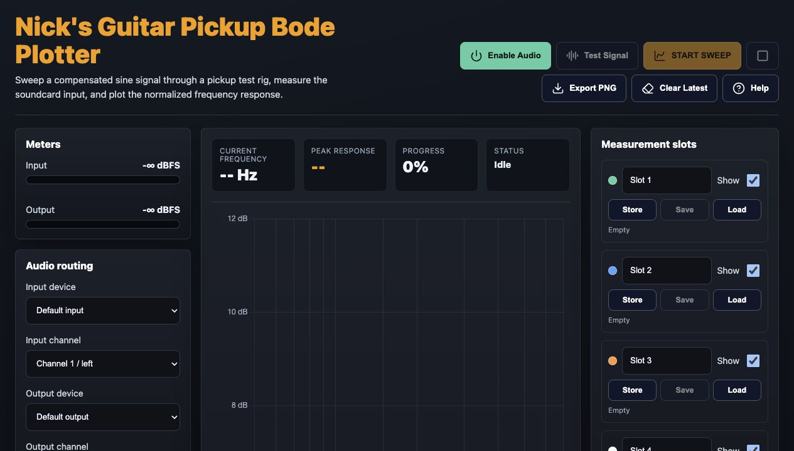
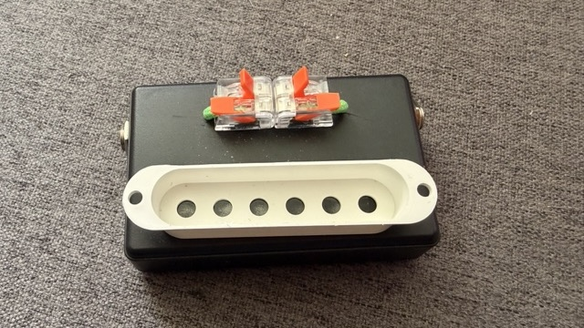
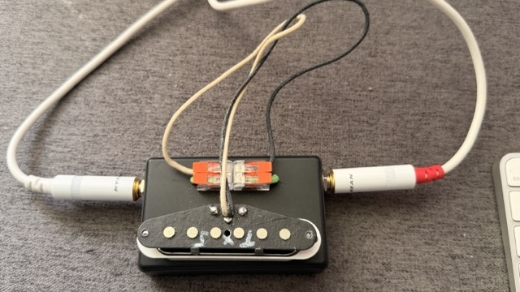
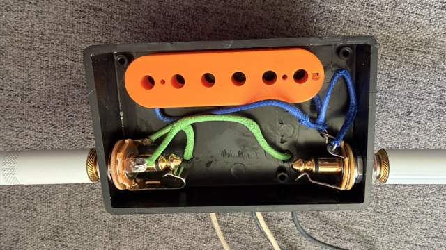

# Nick's Guitar Pickup Bode Plotter

Nick's Guitar Pickup Bode Plotter is a single-file browser tool for exploring the frequency response of guitar pickups. It generates a swept sine signal, measures the returning soundcard input, applies a few practical corrections, and plots a rough Bode-style response curve.

This is meant as an approachable experiment and comparison tool, not a laboratory-grade measurement system. It is useful for playing around with pickup behavior, comparing builds, and getting a visual feel for resonant peaks.

## Features

- Browser-based, single `index.html` app

- Selectable audio input and output devices

- Input and output channel selection

- 1 kHz test signal

- Logarithmic sweep with configurable start/end frequency

- Learned noise-floor subtraction

- Optional sine-only filter

- Adjustable scan duration, readings per point, graph smoothing, graph offset, input sensitivity, and output attenuation

- Six named measurement slots with show/hide, save, and load

- PNG export for the current plot

- Help overlay with setup guidance

- Example files to load into the plotter

- The implementation briefs used with Codex and Claude Code (you can try both implementations by opening the corresponding index.html file. Default is the Claude Code version that I prefer)

  

## How To Use

2. Open the app in a browser: [https://niklaushirt.github.io/bodeplotter/](https://niklaushirt.github.io/bodeplotter/)

3. Place your pickup in the measurement device.

4. Connect the device to your soundcard input and output.

5. Click **Enable Audio** and allow browser microphone/audio permission.

6. Select the input and output devices/channels for your soundcard.

7. Click **Test Signal** to play the 1 kHz signal and confirm the input meter responds.

8. Set the start/end frequency and graph settings as needed.

9. Click **START SWEEP**. The app will first show **Calibrating**, then **Sweeping** once it reaches the selected start frequency.

10. Store useful results in one of the measurement slots, name the slot, and save it to disk if needed.

## Measurement Slots

The six measurement slots let you compare different pickup positions, pickups, wiring options, or sweep settings.

- **Store** copies the latest/current measurement into a slot.
- **Save** downloads the slot as a simple text file.
- **Load** restores a saved measurement text file.
- **Show** controls whether the slot appears on the main graph.

Each slot has its own color. The current/latest measurement is shown in red.

## Notes

- Device names usually appear only after browser audio permission is granted.
- Output device selection depends on browser support for `setSinkId`; unsupported browsers will use the system default output.
- The graph is normalized so the first visible point at the selected start frequency is `0 dB`.
- The plotted dB scale is approximate and intentionally scaled for readability.

## Helpful Links

You will need a coil driver for this to work. [Here](https://www.youtube.com/watch?v=SCeFtqdcS1Y) is a super cool video on how to make one yourself.

It's pretty easy to build.

My everyday coil driver

With a pickup hooked up

The inside

## Helpful Links

- Build your own coil driver: [https://www.youtube.com/watch?v=SCeFtqdcS1Y](https://www.youtube.com/watch?v=SCeFtqdcS1Y)
- For serious pickup plotting, see AxeTech: [https://www.axetech.com](https://www.axetech.com)

©2026 Built with ❤️ by Niklaus Hirt
